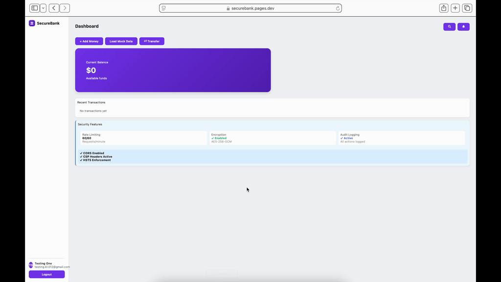

# SecureBank

*Secure Banking Platform (Full-Stack + Security Focused) https://securebank.pages.dev/*



> I built this financial dashboard to practice real-world cloud, API, and web security. The project focuses on implementing secure authentication, protected endpoints, and safe data handling.

## Security Features

| Layer | Implementation |
|-------|----------------|
| **Authentication** | Auth0 + MFA support ([JWT Validation](#jwt-validation-with-rbac)) |
| **API Security** | JWT validation at edge ([Edge Security](#edge-api-security-cloudflare-workers)) |
| **Rate Limiting** | Redis-based sliding window ([Rate Limiter](#core-security-implementation)) |
| **Encryption** | AES-256 at rest, TLS 1.3 ([Encrypted Data](#encrypted-data-layer)) |
| **Audit Trail** | Immutable blockchain-style logs ([Audit Logging](#immutable-audit-logging)) |
| **Input Validation** | Schema + sanitization (OWASP) ([Input Sanitizer](#core-security-implementation)) |
| **Session Mgmt** | HttpOnly cookies + CSRF tokens ([Auth Manager](#frontend-security-reacttypescript)) |

### Core Security Implementation

```typescript
const securityMiddleware = [
  rateLimiter({ window: '15m', max: 100 }),  // rate limiting
  jwtValidator({ audience: 'api://securebank' }), // jwt validation
  corsEnforcer({ origins: ['https://app.securebank.com'] }), // cors
  auditLogger({ immutable: true }), // audit trail
  inputSanitizer(), // input validation
  sqlInjectionGuard() // sql injection prevention
];
```

### JWT Validation with RBAC

```typescript
interface SecurityContext {
  userId: string;
  roles: ['user' | 'admin' | 'auditor'];
  permissions: Permission[];
}

const validateRequest = async (token: string): Promise<SecurityContext> => {
  const decoded = await verifyJWT(token, {
    algorithms: ['RS256'], // strong algorithm enforcement
    issuer: 'https://securebank.auth0.com/'
  });
  
  return {
    userId: decoded.sub,
    roles: decoded.roles,
    permissions: derivePermissions(decoded.roles)
  };
};
```

### Immutable Audit Logging

```typescript
interface AuditEvent {
  timestamp: string;
  eventType: 'auth' | 'transaction' | 'security';
  userId: string;
  action: string;
  result: 'success' | 'failure' | 'blocked';
  hash: string; // sha-256 integrity hash for tamper detection
}

// each event links to previous via hash, creating blockchain-style chain
const logAuditEvent = async (event: AuditEvent): Promise<void> => {
  const previousHash = await getLastEventHash();
  event.hash = createHash(event, previousHash);
  await storeEvent(event);
};
```

### Frontend Security (React/TypeScript)

```typescript
class SecureAuthManager {
  private accessToken: string;
  private refreshToken: string; // httpOnly cookie storage

  async getValidToken(): Promise<string> {
    if (this.isTokenExpired()) {
      await this.refreshTokenPair(); // rotate refresh token
      this.logAuditEvent('token_refresh');
    }
    return this.accessToken;
  }

  private refreshTokenPair(): Promise<void> {
    // refresh token rotation - old token invalidated
    // new tokens issued with short expiry
  }
}
```

### Edge API Security (Cloudflare Workers)

```typescript
async function handleRequest(request: Request): Promise<Response> {
  // defense in depth: multiple validation layers
  await rateLimiter.check(request);      // 1. rate limit (DDoS protection)
  const context = await authenticate(request); // 2. jwt validate
  const cleanBody = await sanitizeInput(request.body); // 3. sanitize (XSS)
  authorize(context, request.method);    // 4. authorize (RBAC)
  return await executeWithAudit(context, () => {
    return processRequest(cleanBody);    // 5. execute with audit trail
  });
}
```

### Encrypted Data Layer

```typescript
class SecureRepository<T> {
  async create(data: T): Promise<T> {
    // field-level encryption for sensitive data
    const encrypted = await this.encryptSensitiveFields(data, {
      fields: ['ssn', 'accountNumber', 'routingNumber'],
      algorithm: 'AES-256-GCM',
      keyRotation: true
    });
    
    const result = await this.db.insert(encrypted);
    await this.auditLogger.log('create', {
      id: result.id,
      action: 'data_creation',
      encryption: 'AES-256'
    });
    
    return result;
  }
}
```

## Compliance Overview

| Standard | Implementation |
|----------|----------------|
| **SOC2** | Access controls, monitoring |
| **GDPR** | Encryption, audit trails |
| **PCI-DSS** | Encrypted PII, logging |
| **OWASP Top 10** | Validation, auth controls |
